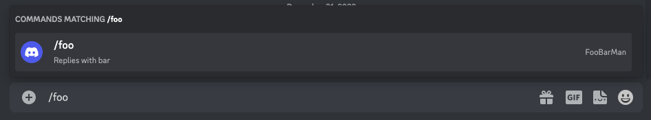
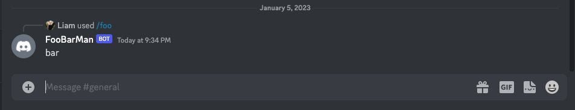
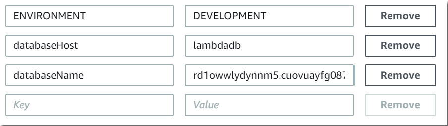

# Serverless Discord Bot

This is a simple discord bot application written in Go and hosted on AWS using Amazon API Gateway and AWS Lambda. The bot application will respond to slash command `/foo` and return a message  `"bar"`.

If you're looking for an in-depth guide on how to build a serverless discord bot then please read this article: `<Work In Progress>`

## Table of contents

- [Demo](#demo)
- [High Level Architecture](#high-level-architecture)
- [AWS Lambda](#aws-lambda)
- [Discord Interactions Endpoint URL Verification](#discord-interactions-endpoint-url-verification)
- [Register Discord Slash Commands](#register-discord-slash-commands)
- [Helpful Extra Resources](#helpful-extra-resources)

## Demo

### Entering discord slash command



### Receiving the discord bot response



## High Level Architecture


## AWS Lambda

### Development & deployment

Unfortunately at this point of time (December 2022) the AWS Lambda console code editor does not support the Go runtime. The alternative is to write the lambda handler code locally and build the package. Followed by zipping the build artifact and uploading the .zip file to AWS Lambda.

#### Creating a .zip file on MacOS or Linux

 ```bash
 GOOS=linux GOARCH=amd64 go build -o main main.go util.go
 zip main.zip main
 ```

#### Uploading .zip file to AWS Lambda console via AWS CLI

```bash
aws lambda update-function-code --function-name discord_event_handler --zip-file fileb://main.zip
```

### Configuring environment variables

On the AWS Lambda console developers can add environment variables as key value pairs. In this project the discord application's public key is added in the Lamba's configuration as key `DISCORD_PUBLIC_KEY`.



## Discord Interactions Endpoint URL Verification

The discord bot will be receiving commands in the form of an Interaction. [An Interaction is a message that a discord application receives when a user uses an application command or message component](https://discord.com/developers/docs/interactions/receiving-and-responding#interactions).

This discord application will receive Interactions via webhook messages. In the Discord Developer Portal -> Application -> General Information page there is a field called `INTERACTIONS ENDPOINT URL` where URL can be provided to receive outgoing webhook messages.

There are two requirements that need to be fulfilled ahead of time before providing the endpoint URL in the developer portal. These requirements are for the service listening to webhook messages to:

1. ACK a `PING` message
2. Verify the signature of the webhook message -- details explained [here](https://discord.com/developers/docs/interactions/receiving-and-responding#security-and-authorization)

Failure to fulfill the above requirements will result in an error on the developer portal when providing the endpoint URL. The error message returned will be displayed as:

 `interactions_endpoint_url: The specified interactions endpoint could not be verified`

## Register Discord Slash Commands

The discord bot will be responding to slash commands made by a user on a discord server. The slash commands need to be first registered for the discord application. Discord provides an API endpoint for developers to call to register commands. Developers will have to provide `application_id` and `bot_token` or `credentials_token` when calling the API.

Below is a sample python script to register commands for discord application:

```Python
import requests

url = "https://discord.com/api/v10/applications/<my_application_id>/commands"

# This is an example CHAT_INPUT or Slash Command, with a type of 1
json = {
    "name": "foo",
    "type": 1,
    "description": "Responds with bar"
}

headers = {
    "Authorization": "Bot <my_bot_token>"
}

r = requests.post(url, headers=headers, json=json)
```

## Helpful Extra Resources

- [Deploy Go Lambda functions with .zip file archives](https://docs.aws.amazon.com/lambda/latest/dg/golang-package.html)
- [Using AWS Lambda with Amazon API Gateway](https://docs.aws.amazon.com/lambda/latest/dg/services-apigateway.html)
- [Tutorial: Build a Hello World REST API with Lambda proxy integration](https://docs.aws.amazon.com/apigateway/latest/developerguide/api-gateway-create-api-as-simple-proxy-for-lambda.html)
- [Discord Developer Portal Documentation](https://discord.com/developers/docs/intro)
- [Using AWS Lambda environment variables](https://docs.aws.amazon.com/lambda/latest/dg/configuration-envvars.html)
