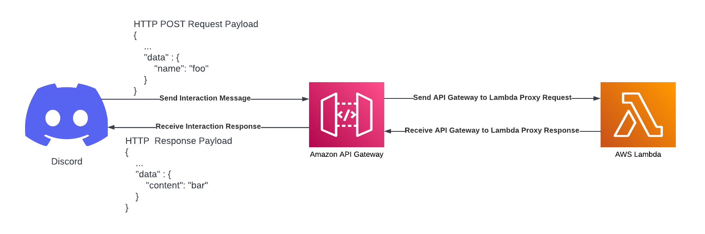

# Serverless Discord Bot

This is a simple discord bot application written in Go and hosted on AWS using API Gateway and Lambda. The bot application will respond to slash command `/foo` and return a message  `"bar"`. 

If you're looking for an in-depth guide on how to build a serverless discord bot then please read this article: `<placeholder>`

## Table of contents

- [High Level Architecture](#high-level-architecture)
- [Deploy AWS Lambda](#deploy-aws-lambda)
- [Helpful Extra Resources](#helpful-extra-resources)

## High Level Architecture



## Deploy AWS Lambda

Unfortunately at this point of time (December 2022) the AWS Lambda console code editor does not support the Go runtime. The alternative is to write the lambda handler code locally and build the package. Followed by zipping the build artifact and uploading the .zip file to AWS Lambda.

### Creating a .zip file on MacOS or Linux
 ```
 GOOS=linux GOARCH=amd64 go build -o main main.go util.go
 zip main.zip main
 ```
### Uploading .zip file to AWS Lambda console via AWS CLI
```
aws lambda update-function-code --function-name discord_event_handler --zip-file fileb://main.zip
```

## 

## Helpful Extra Resources
- [Deploy Go Lambda functions with .zip file archives](https://docs.aws.amazon.com/lambda/latest/dg/golang-package.html)
- [Using AWS Lambda with Amazon API Gateway](https://docs.aws.amazon.com/lambda/latest/dg/services-apigateway.html)
- [Tutorial: Build a Hello World REST API with Lambda proxy integration](https://docs.aws.amazon.com/apigateway/latest/developerguide/api-gateway-create-api-as-simple-proxy-for-lambda.html)

